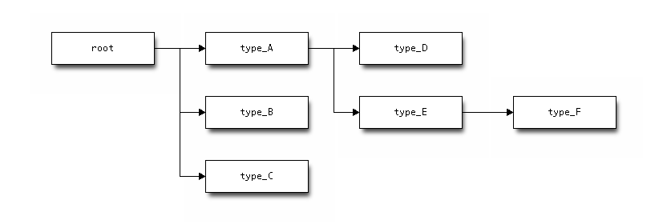
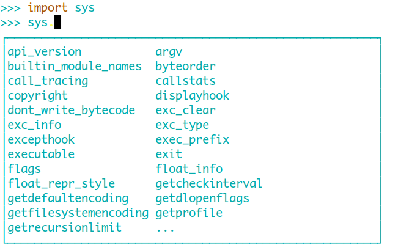

# Dynamique

# variable -> objet -> type

Inutile de typer la variable, mais seulement l&#39;objet :

    !python
    myvar  = 1          # objet int
    myvar = "My string" # objet string
    myvar = ['a']       # objet list

Le type est vérifié à l&#39;éxécution.

---

# «Fortement» typé

Pas de **cast** automatique :

    !python
    >>> a = 1
    >>> b = "my string"
    >>> a + b
    Traceback (most recent call last):
      File "<stdin>", line 1, in <module>
    TypeError: unsupported operand type(s) for +: 'int' and 'str'

.notes: le typage est une échelle, plus ou moins typé

---

# Duck typing

# Vérifie uniquement que la méthode appelée existe et non le type.

.fx: centerquote

> When I see a bird that walks like a duck and swims like a duck
> and quacks like a duck, I call that bird a duck

---

# Un exemple simple

    !python
    class Duck:
        def quack(self):
            print("Quaaaaaack!")
        def feathers(self):
            print("The duck has white and gray feathers.")
 
    class Person:
        def quack(self):
            print("The person imitates a duck.")
        def feathers(self):
            print("The person takes a feather from the ground and shows it.")
        def name(self):
            print("John Smith")
 
    def in_the_forest(duck):
        duck.quack()
        duck.feathers()
 
    def game():
        donald = Duck()
        john = Person()
        in_the_forest(donald)
        in_the_forest(john)
 
    game()

---

# Polymorphisme

# Le Duck Typing permet le polymorphisme.

Comparable au :

* structural type
* interface
* template

---

# **Défauts**

---

# Pas de code métier autour d&#39;un type

# Nécessite de mieux connaitre le métier

    !python
    class Person:
        def quack(self):
            print("The person imitates a duck.")
        def feathers(self):
            print("The person takes a feather from the ground and shows it.")
        def name(self):
            print("John Smith")

---

# Collage de code non vérifié

    !python
    def my_function(a, b, c, d):
        do_something()

    my_function('a', 2, [], {})

---

# Facilite le code spaghetti

    !python
    struct = {}
    ...
    struct = []
    ...
    struct = ({}, {})

---

# Plus facile de pousser un bug en production

# Aucun avertissement du compilateur

    !python
    def myfunction(value = []):
        do_something()
    ...
    myfunction({'x':1})

---

# Autres

# Pas de refactoring automatique

Même si des IDE comme PyCharm font des progrès.

# Performance

Projet v8 pour JS / LuaJIT / PyPy / Rubinius

---

# **Avantages**

---

# Code structuré en de blocs fonctionnels

# Je n&#39;ai plus besoin de gérer mon arbre de types :

* Limite l&#39;inter-dépendance
* Collage de code simplifié

---

# Simple

# Pousse à la simplicité

    !python
    class Myclass(object):
        def functionA(self):
            do_something()

        def functionB(self):
            do_something()

        def functionC(self):
            do_something()

        def my_function(self):
        ....

---

# Souple

# Il suffit de donner la méthode voulue. La surcharger est triviale :

    !python
    from module import MyClass

    class ReplaceClass(object)
    ...

    MyClass = ReplaceClass

---

# API simplifiée

# Pas besoin d&#39;un code pour le type X, le type Y, le type Z.

    !python
    len(struct)

# Un code qui fonctionne avec des structures différentes :

    !python
    class MyClass(object):
        def funcA(self, values):
            for i in values:
                do_something()

    C = MyClass()
    C.funcA('1, 2, 3')
    C.funcA(['1, 2, 3'])
    C.funcA(('1, 2, 3'))

---

# Introspection

    !python
    class foo(object):
        def __init__(self, val):
            self.x = val
        def bar(self):
            return self.x
 
    >>> dir(foo(5))
    ['__class__', '__delattr__', '__dict__', '__doc__', '__getattribute__', '__hash__', '__init__', '__module__',
'__new__', '__reduce__', '__reduce_ex__', '__repr__', '__setattr__', '__str__', '__weakref__', 'bar', 'x']

    !python
    >>> a = foo(10)
    >>> isinstance(a, foo)
    True
    >>> hasattr(a, 'bar')
    True

---

# Moins de lignes

# Moins de lignes, moins de bugs

Le nombre de bugs par ligne ne dépend pas du langage.

# Moins de lignes, plus de facilité à comprendre

Il est plus facile d&#39;appréhender 10 lignes que 20, 50 que 100, 1000 que 5000.

---

# Evaluateur en ligne

.fx: image

---

# Compenser les lacunes

---

# Documentation

Documenter les interfaces (entrée, sortie, exception)

    !python
    def create_conf(work_dir, software, chassis):
        """Create an configuration file

        :param: work_dir: the directory
        :type: work_dir: string
        :param: software: type of software
        :type: software: string
        :param: chassis: type of chassis
        :type: chassis: string
        :returns: nothing
        :raises: nothing
        """

Documenter, mais surtout pourquoi, pas comment !

Sauf comment quand c&#39;est :

* complexe
* non naturel (bug, besoin...)

---

# Doctest

# Ecrire de la documentation valide

    !python
    class Net(object):
    """Simple usage of SubNet constructed above CIDR implementation.

    You can specify your address in both ipv4 or ipv6 CIDR notation:

    >>> Net('192.168.0.0/24')
    Net('192.168.0.0/24')

    >>> Net('::ffff:192.168.0.0/120')
    Net('192.168.0.0/24')

    But also with '*' notation::

    >>> Net('192.168.0.*')
    Net('192.168.0.0/24')

    >>> Net(24)
    Traceback (most recent call last):
    ...
    TypeError: ..
    """

---

#Refactorer souvent

# Refactoring, refactoring, refactoring...

Idéalement c&#39;est 50% du temps de codage.

---

# Strong typing vs Strong testing

La phase de compilation est un sous ensemble de la phase d&#39;éxécution

# Beaucoup de tests.

* Les Tests Unitaires couvrent le refactoring
* Les Tests fonctionnels couvrent le fonctionnement général
* Les Tests de bout en bout couvrent les besoins client

Regardez les nouveautés Unittest2 (Python2.7+)

---

# First class citizen

Wikipedia : http://en.wikipedia.org/wiki/First-class_citizen

Entité qui peut :

* Passée en paramêtre
* Passée en argument
* Retournée comme valeur de retour
* Incorporée dans une structure de donnée

En python, tous les objects sont *first class*.

---

# Exemple 1

On peut écrire :

    !python
    def sumOfSquares(a, b):
        return a**2 + b**2

    def sumOfCubes(a, b):
        return a**3 + b**3

    def sumOfNegatives(a, b):
        return (-a) + (-b)

---

# Exemple 1

Un code *pythonic* :

    !python
    def square(a):
        return a**2

    def cube(a):
        return a**3

    def negative(a):
        return -a

    def sum (a, b, function):
        return function(a) + function(b)

Un code *pythonic* avec le style fonctionnel :

    !python
    sumOfSquares = lambda a, b: sum(a, b, square)
    sumOfCubes = lambda a, b: sum(a, b, cube)

---

# Exemple 2

Je souhaite afficher du texte en spécifiant la couleur :

    !python
    from fabric.colors import *

    def display(msg, color=green):
        print(color(msg))

---

# Exemple 3

Un dispatcher :

    !python
    def handle_one():
        return 'one'

    def handle_two():
        return 'two'

    def handle_default():
        return 'unknown'

    cases = {
        'one': handle_one,
        'two': handle_two,
        'three': lambda: 'three',
    }

    for i in ('one', 'two', 'three', 'four', ):
        handler = cases.get(i, handle_default)
        print handler()

