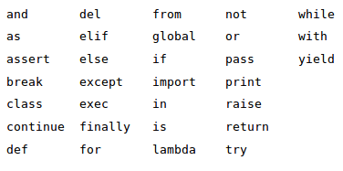
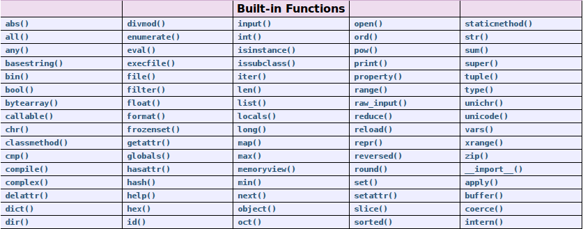
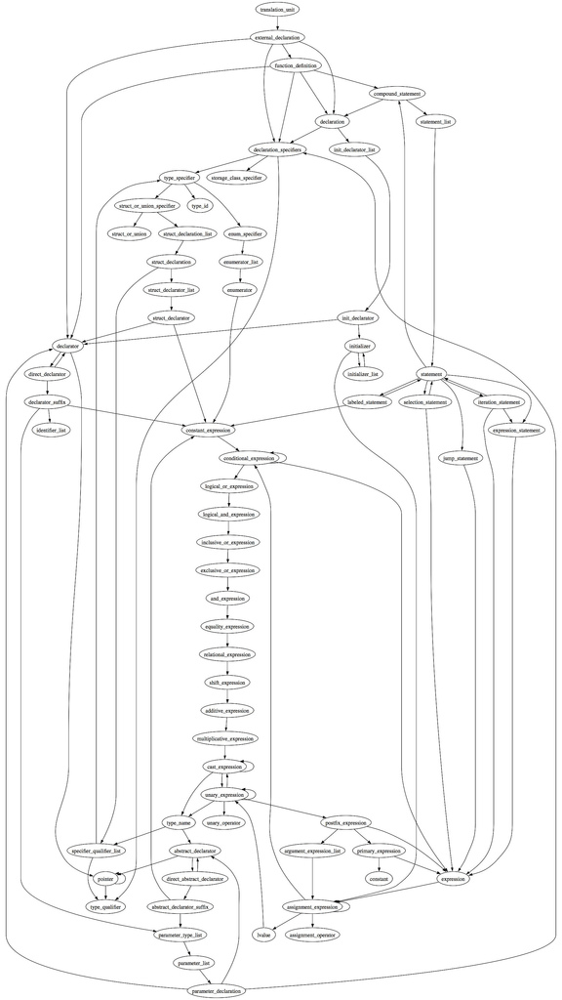
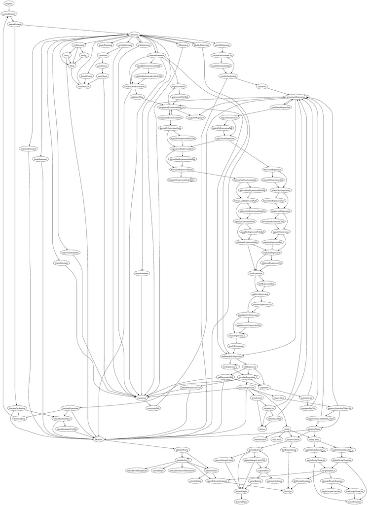
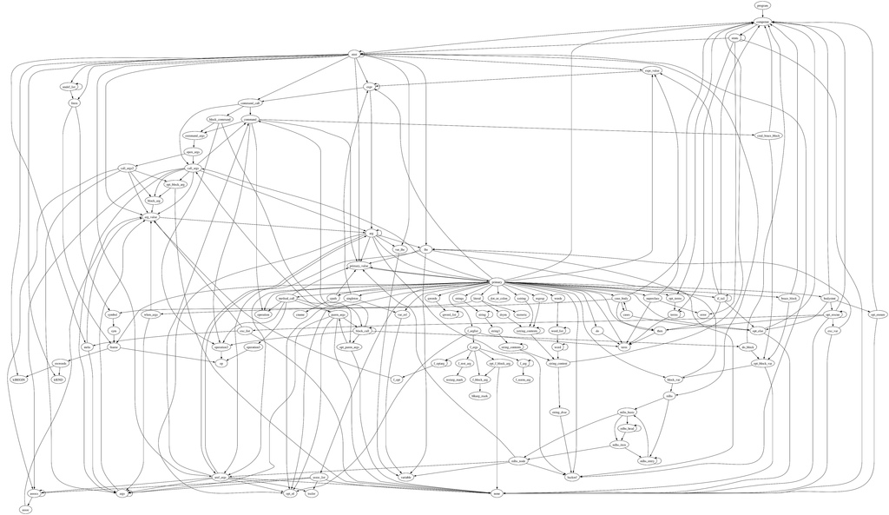
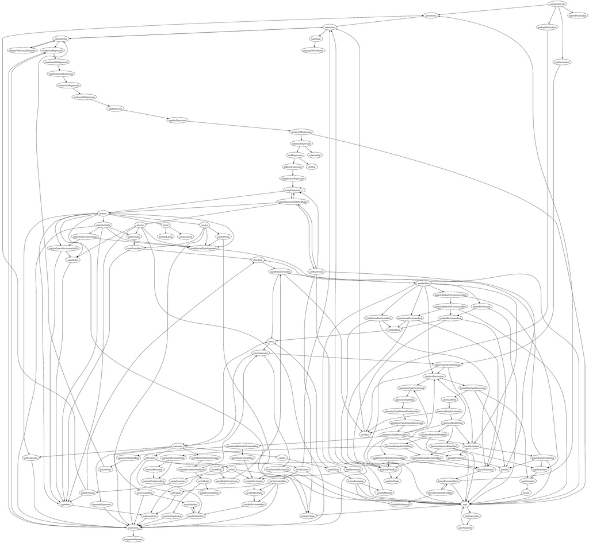
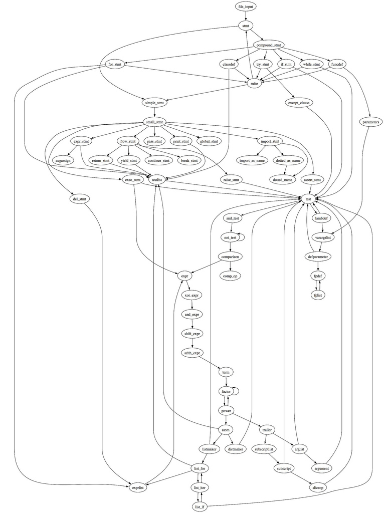
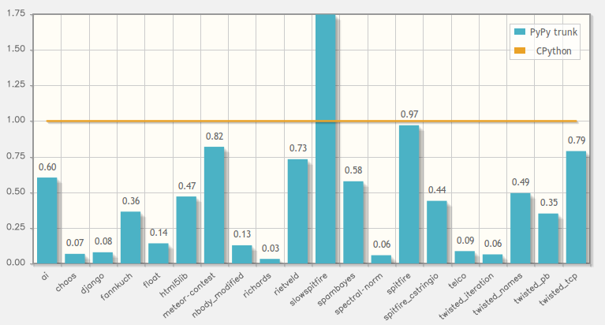

# Dans mon entreprise

Nous fournissons des **appliances**.

Le code actuel :

* Python - **70k** SLOC
* C - **25k** SLOC
* Guile (Scheme) - **2.5k** SLOC

Il y&#39;a 1 an : **120k** SLOC

# SLOC total (3,5 ans)

Entre **350k** et **500k** SLOC

# Moyenne de développeurs

Entre 4 et 5

---

# Un langage est un univers

.fx: image

---

# Comprendre un univers

# Chaque langage est une *vision* du développement

.fx: bigbullet

* choix technique
* une philosophie
* une sémantique
* une syntaxe

--- 

# Tout est question d&#39;équilibre

.fx: title

---

# import antigravity - xkcd.com/353/

.fx: image

--- 

# Citations

> “Controlling complexity is the essence of computer programming.”
(Brian Kernigan) 
 
> “Complexity kills.  It sucks the life out of developers, it makes products difficult to plan, build and test, it introduces security challenges, and it causes end-user and administrator frustration.”
(Ray Ozzie) 
 
> “Everything should be made as simple as possible, but not simpler.”
(Albert Einstein)

---

# Domaine d&#39;utilisation

Le site `Python Success` cite ces catégories :

* Web
* Jeu vidéo
* Graphisme / 3D
* Finance
* Science
* Développement logiciel
* Education
* Logiciel business
* Gouvernement

---

# Sociétés utilisatrices connues

* RedHat / Ubuntu / Mozilla
* Disney / Industrial Light & Magic
* Yahoo!
* Blender
* ITA Software
* Bittorrent
* CERN / NASA
* Dropbox
* Eventbrite
* YouTube
* Disqus / SurveyMonkey
* Rackspace Hosting
* QNX

---

# Google

**Google** est un des plus grands utilisateurs de Python :

> Python where we can, C++ where we must

Le prototype fut développé en Python.

# Beaucoup de développeurs connus chez google :

* Guido Van Rossum
* Alex Martelli
* Greg Stein
* Wesley Chun
* Fredrik Lundh
* Thomas Wouters
* Collin Winters

--- 

# Initier au développement

* MIT (6.001, apprendre à programmer un robot)
* Université Paris-Dauphine (Informatique pour la Finance)
* Institut Pasteur (Informatique en Biologie)
* University of Oxford (Département de physique)
* Université de Cambridge
* Université de Stanford
* ...

---

# historique  (1)

# Le projet démarre en 1989 :

* 0.9.0 = 1991
* 1.0.0 = 1994
* 1.5.2 = 1998
* 1.6.0 = 2000

--- 

# historique  (2)

# Première évolution :

* 2.0.0 = 2000
* 2.1.0 = 2001
* 2.2.0 = 2002
* 2.3.0 = 2003
* 2.4.0 = 2004 (plus maintenue)
* 2.5.0 = 2006 (fin de maintenance : 10/2011)
* 2.6.0 = 2008
* 2.7.0 = 2010 (dernière branche 2.x officielle)

--- 

# historique  (3)

# Ré-écriture de Python (branche 3.x) :

* 3.0 = 2008
* 3.1 = 2009
* 3.2 = 2011

---

# philosophie

# lisibilité

Ne pas se poser de question sémantique / syntaxique quand on lit du code

# Homogénéité

Une seule manière de faire une chose.

# Explicite

Pas de magie noire.

# Concision

# simplicité

# extensible

# battery included

Avoir le minimum pour travailler (~300 modules)

---

# Ma citation préférée sur Python

> Ce qui est simple doit rester simple, ce qui est compliqué doit est possible

--- 

# Résultat

# Un langage :

* expressif (pseudo code)
* consistent
* orthogonal (manuel de référence : ~100 pages)

--- 

# 31 mots clés

.fx: image

---

# Builtins

.fx: image

---

# PEP : Python Enhancement Proposal

.fx: image

---

# Grammaire du C

.fx: image

---

# Grammaire du Javascript

.fx: image

---

# Grammaire de 1.8.4

.fx: image

---

# Grammaire de Java 1.5

.fx: image

---

# Grammaire de Python 2.3.3

.fx: image

---

# Gestion de projet saine

Fonctionnalité d&#39;une version N+1 dans la version N :

    !python
    from future import with_statement

Inversement, il existe les `DeprecationWarning` et `PendingDeprecationWarning`.

# Backport de modules 2.7 / 3.2 sur Python 2.5 / 2.6.

Modules packaging, unittest2...

# CPython

Souvent cité comme du code C de belle facture, peu de plantage connu.

---

# Sémantique (paradigme)

.fx: bigbullet

* structuré
* objet
* fonctionnel

---

# Structuré simple

Format script (fichier sample.py) :

    !python
    print "hello world!"

Exécution :

    $ python sample.py
    hello world!

---

# Structuré avec méthode

Transformation en code structuré avec des méthodes : 

    !python
    def hello_world():
        print "hello world!"

    if __name__ == '__main__':
        hello_world()

Je peux utiliser la méthode en important mon fichier :

    !python
    from sample import hello_world
    hello_world()

---

# objet

Transformation en code objet :

    !python
    class MyClass(object):
       def hello_world(self):
           print "hello world!"
 
    if __name__ == '__main__':
        test = MyClass() 
        test.hello_world()

---

# Fonctionnel

Python implèmente `lambda`, `map`, `filter`, `reduce` :

    !python
    total = reduce(lambda a, b: (0, a[1] + b[1]), items)[1]

Les itérateurs :

    !python
    L = [1,2,3]
    it = iter(L)
    it.next()

Un code plus `pythonic` :

    !python
    L = [1,2, 3]
    for i in L:
    ...

Générateur d&#39;expression (retourne un itérateur) :

    !python
    stripped_iter = (line.strip() for line in line_list)

List comprehension (retourne un objet liste) :

    !python
    stripped_list = [line.strip() for line in line_list]

Module `functools`, `itertools`, `operator`.

---

# pythonic / unpythonic

---

# Exemple

unpythonic :

    !python
    i = 0
    while i < mylist_length:
        do_something(mylist[i])
        i += 1

pythonic :

    !python
    for element in mylist:
        do_something(element)

pythonic avec gestion de l&#39;indice :

    !python
    for indice, element in enumerate(mylist):
        do_something(element)
        print indice

---

# Package Python

La présence d&#39;un fichier vide `__init__.py` dans un répertoire...

    !bash
    $ cd mydir
    $ touch __init__.py

... le transforme en **package** Python :

    !python
    from mydir.sample import MyClass

---

# Classpath (à la compilation)

# Principaux répertoires :

* .
* /usr/lib/python2.7
* /usr/lib/python2.7/dist-packages
* /usr/local/lib/python2.7/dist-packages
* /home/`<user>`/.local/lib/python2.7/site-packages

---

# Caractéristiques :

.fx: bigbullet

* Dynamique
* Fortement typé
* Duck typing

---

# Dynamique

# variable -> objet -> type

Inutile de typer la variable, mais seulement l&#39;objet :

    !python
    a = 1            # objet int
    a = "My string"  # objet string

Le type est vérifié à l&#39;éxécution.

---

# Fortement typé

Pas de **cast** automatique :

    !python
    >>> a = 1
    >>> b = "my string"
    >>> a + b
    Traceback (most recent call last):
      File "<stdin>", line 1, in <module>
    TypeError: unsupported operand type(s) for +: 'int' and 'str'

.notes: le typage est une échelle, plus ou moins typé

---

# Duck typing

# Vérifie uniquement que la méthode appelée existe et non le type.

.fx: centerquote

> When I see a bird that walks like a duck and swims like a duck
> and quacks like a duck, I call that bird a duck

---

# Rappel sur le type statique

# Avantages :

* Clarification
* Détection d&#39;erreur à la compilation
* Performance
* Refactoring automatique

# Défauts :

* Création d&#39;interfaces incompatibles
* Ne pousse pas la factorisation
* Boilerplate
* Refactoring plus dangereux

---

# Un exemple simple

    !python
    class Duck:
        def quack(self):
            print("Quaaaaaack!")
        def feathers(self):
            print("The duck has white and gray feathers.")
 
    class Person:
        def quack(self):
            print("The person imitates a duck.")
        def feathers(self):
            print("The person takes a feather from the ground and shows it.")
        def name(self):
            print("John Smith")
 
    def in_the_forest(duck):
        duck.quack()
        duck.feathers()
 
    def game():
        donald = Duck()
        john = Person()
        in_the_forest(donald)
        in_the_forest(john)
 
    game()

---

# Polymorphisme

# Le Duck Typing permet le polymorphisme.

Comparable au :

* structural type
* interface
* template

---

# **Défauts**

---

# Nécessite de mieux connaitre le fonctionnel

---

# Collage de code non vérifié

---

# Facilite le code spaghetti

---

# Plus facile de pousser un bug en production

---

# Pas de refactoring automatique

---

# Performance

---

# Aucun avertissement du compilateur

---

# **Avantages**

---

# Simple

---

# Pousse à la simplicité

---

# Souple

---

# Généricité

---

# API simplifiée

---

# Collage de code simplifié

---

# Simplifie le refactoring

---

# limite l&#39;inter-dépendance

---

# - de lignes = - de bugs

---

# - de lignes = + facile à comprendre

---

# Pas de phase de compilation

---

# Introspection

---

# Evaluateur en ligne

---

# Compenser les lacunes

Avec :

* Documentation (entrée, sortie, exception)
* Doctest
* Refactorer souvent
* Strong typing vs Strong testing

---

# First class function / First class object

Entité qui peut :

* Passée en paramêtre
* Passée en argument
* Retournée comme valeur de retour
* Incorporée dans une structure de donnée

En python, tous les objects sont *first class*.

---

# Exemple 1

On peut écrire :

    !python
    def sumOfSquares(a, b):
        return a**2 + b**2

    def sumOfCubes(a, b):
        return a**3 + b**3

    def sumOfNegatives(a, b):
        return (-a) + (-b)

---

# Exemple 1

Un code *pythonic* :

    !python
    def square(a):
        return a**2

    def cube(a):
        return a**3

    def negative(a):
        return -a

    def sum (a, b, function):
        return function(a) + function(b)

Un code *pythonic* avec le style fonctionnel :

    !python
    sumOfSquares = lambda a, b: sum(a, b, square)
    sumOfCubes = lambda a, b: sum(a, b, cube)

---

# Exemple 2

Je souhaite afficher du texte en spécifiant la couleur :

    !python
    from fabric.colors import *

    def display(msg, color=green):
        print(color(msg))

---

# Exemple 3

Un dispatcher :

    !python
    def handle_one():
        return 'one'

    def handle_two():
        return 'two'

    def handle_default():
        return 'unknown'

    cases = {
        'one': handle_one,
        'two': handle_two,
        'three': lambda: 'three',
    }

    for i in ('one', 'two', 'three', 'four', ):
        handler = cases.get(i, handle_default)
        print handler()

---

# EAFP vs LBYL

Python pousse à la programmation :

*EAFP* (Easier to Ask for Forgiveness than Permission)

et non : 

*LBYL* (Look before you Leap)

    !python
    import sys
    
    try:
        f = open('myfile.txt')
        s = f.readline()
        i = int(s.strip())
    except IOError as (errno, strerror):
        print "I/O error({0}): {1}".format(errno, strerror)
    except ValueError:
        print "Could not convert data to an integer."
    except:
        print "Unexpected error:", sys.exc_info()[0]
        raise

---

# Types de base

# Simples et puissants :

* bool
* int, float, complex
* str, unicode
* tuple
* set, frozenset
* dictionary
* xrange
* file
* exception, module, fonction

---

# Méthodes spéciales

# Basique

* object.\_\_new__(self, other)
* object.\_\_del__(self, other)
* object.\_\_init__(self, other)
* object.\_\_repr__(self, other)
* object.\_\_str__(self, other)
* object.\_\_eq__(self, other)
* object.\_\_cmp__(self, other)
* object.\_\_get__(self, other)
* object.\_\_set__(self, other)
* ...

---

# Méthodes spéciales

# Appelable

* object.\_\_call__(self, other)

# Conteneur

* object.\_\_len__(self)
* object.\_\_getitem__(self)
* object.\_\_setitem__(self)
* object.\_\_delitem__(self)
* object.\_\_iter__(self)

# Context manager

* object.\_\_enter__(self)
* object.\_\_exit__(self)

---

# Exemples

    !python
    def __repr__(self):
        return repr(self.data) 

    def __cmp__(self, dict):                      
        if isinstance(dict, UserDict):            
            return cmp(self.data, dict.data)      
        else:                                     
            return cmp(self.data, dict)           
    
    def __len__(self):
        return len(self.data)

    def __delitem__(self, key):
        del self.data[key]

---

# Decorateur

Un décorateur permet d&#39;injecter ou de modifier le comportement d&#39;une fonction / classe.

Un décorateur simple :

    !python
    def decorator(func):
        func.is_decorate = True
        return func

    @decorator
    def decorate():
        pass

    decorate.is_decorate

Un décorateur avec un argument :

    !python
    def decorator(attempt):
        def wrapper(func):
            func.attempt = attempt
            return func
        return wrapper

---

# Quelques cas d&#39;utilisation :

* Memoize
* Cache
* Ajout facile de méthodes à une classe
* Compteur
* Deprecation Warnings
* Pre / post condition
* Profiling / debug
* Synchronisation
* Vérification de type
* ACL
* Gestion d&#39;évenement
* Singleton
* ...

---

# Itérateur

# Beaucoup de types de base sont itérables.

On retrouve la philosophie *Faire les choses d&#39;une seule manière* :

    !python
    for element in [1, 2, 3]:
        print element

    for element in (1, 2, 3):
        print element

    for key in {'one':1, 'two':2}:
        print key

    for char in "123":
        print char

    for line in open("myfile.txt"):
        print line

--- 

# Itérateur

Créer un type itérable :

    !python
    class fibnum:
        def __init__(self):
            self.fn2 = 1
            self.fn1 = 1

        def next(self):
            (self.fn1,self.fn2,oldfn2) = (self.fn1+self.fn2,self.fn1,self.fn2)
            return oldfn2

        def __iter__(self):
            return self

    f = fibnum()
    for i in f:
        print i
        if i > 20:
            break

---

# Générateur

Utilisation du mot clé `yield` :

    !python
    def fonction(x):
        while 1:
            yield x
            x = x + 1

     >>> gen = fonction(2)
     >>> gen.next()

---

# List comprehension

Une *list comprenhension* renvoie une liste.

    !python
    S = [2*x for x in range(101) if x**2 > 3]

    T = [x+y for x in 'flower' for y in 'pot']

    U = [x+y for x in 'flower' for y in 'pot' if x != 'w' and y != 'o' ]

Existe aussi pour les set (set comprehension) et dictionary (dictionary comprehension).

---

# Droit

# Pas de notion privé / public.

La convention est de mettre un **_** pour indiquer une méthode privée.

---

# Context manager

Sucre syntaxique qui simplifie le code :

    !python
    with open('foo.txt', 'w') as f:
        f.write('hello!')

Au lieu de :

    !python
    f = open('foo.txt', 'w')
    f.write('hello!')

---

# Lien avec le C

Module ctypes pour utiliser facilement le C :

    !python
    from ctypes import *
    cdll.LoadLibrary("libc.so.6")
    libc = CDLL("libc.so.6")

Projets cython / SWIG.

---

# zope.interface

Création d&#39;une interface :

    !python
    import zope.interface
    class IFoo(zope.interface.Interface):
        """Foo blah blah"""
        
        x = zope.interface.Attribute("""X blah blah""")

        def bar(q, r=None):
           """bar blah blah"""

Utilisation : 

    !python
    class Foo:
        zope.interface.implements(IFoo)

        def __init__(self, x=None):
            self.x = x

        def bar(self, q, r=None):
            return q, r, self.x

        def __repr__(self):
            return "Foo(%s)" % self.x

---

# zope.component

# Compose la `ZCA` (Zope Component Architecture) `zope.interface` et `zope.event`.

Utilise `zope.interface` pour offrir des :

* utilities
* adapter
* subscriptions adapters
* handlers

--- 

# PyPI

Le serveur **PyPI** (http://www.python.org/pypi) liste toutes les distributions disponibles :

**15 200** packages disponibles.

---

# pip

L&#39;utilitaire pip permet de manipuler les packages :

    $ pip freeze
    distribute==0.6.16
    mercurial==1.8.3
    virtualenv==1.6.1
    wsgiref==0.1.2

    $ pip search pyramid
    pyramid_simpleform        - pyramid_simpleform
    pyramid                   - The Pyramid web application framework, a Pylons project
    pyramid_mailer            - Sendmail package for Pyramid
    pyramid_pyctpp2           - pyctpp2 template bindings for the Pyramid web framework
    pyramid_jinja2            - Jinja2 template bindings for the Pyramid web framework
    pyramid_socketio          - Gevent-based Socket.IO pyramid integration and helpers
    pyramid_beaker            - Beaker session factory backend for Pyramid
    pyramid_viewgroup         - An anlologue of Zope 3 "content providers" for Pyramid
    ...

    $ pip install pyramid

---

# virtualenv

L&#39;utilitaire `virtualenv` de créer un environnement virtual :

    $ virtualenv --no-site-packages newenv
    New python executable in newenv/bin/python
    Installing setuptools............done.
    Installing pip...............done.

    $ ls newenv/
    bin  include  lib

    $ ls newenv/bin/
    activate      activate.fish     easy_install      pip      python
    activate.csh  activate_this.py  easy_install-2.7  pip-2.7

---

# buildout

Outil de génération d&#39;environnement répétable

# Extensible avec des `recipes`. Il en existe pour :

* installer des applications (Apache, Nginx...)
* configurer 
* générer des scripts
* ...

# Exemple avec 2 recipes de ma société :

* sact.recipe.junkie
* sact.recipe.postgresql

--- 

# buildout - configuration basique

    !bash
    [buildout]
    develop = .

    parts = myapp

    [myapp]
    recipe = zc.recipe.egg
    eggs = myeggs

---

# pythonbrew

L&#39;utilitaire `pythonbrew` permet d&#39;installer l''interpréteur CPython dans son `$HOME` :

    $ pybrew list -k
    # available install pythons
    Python-1.5.2
    ...
    Python-2.5.5
    Python-2.6.6
    Python-2.7.1
    Python-3.0.1
    Python-3.1.3
    Python-3.2
    
    $ pybrew install 2.7.1

---

# Interpréteurs

L&#39;interpréteur de référence est **CPython**. Mais il exsite :

* IronPython (.NET)
* Jython (Java Virtual Machine)
* PyPy (JIT compiler)
* Stackless Python (microthreads)

**PyPy** est le futur !

---

# PyPy - http://www.pypi.org

# PyPy est un interpréteur Python qui inclus un **JIT** fait en... Python.

PyPy est constitué de deux composants :

* un interpréteur Python, écrit en **RPython**
* une chaîne d&#39;outils qui analyse RPython et le traduit en un langage bas niveau

Il manque encore l&#39;API C.

Backends :

* CLI
* JVM 
* Javascript (abondonné)
* LLVM (à l&#39;étude)

---

# PyPy - http://speed.pypy.org

Actuellement **3.7x** plus rapide que CPython (peut monter à 10x à 40x) :

---

# Python 2 ou Python 3 ?

# Python 2.7.x est la dernière branche 2.x

L&#39;objectif de la communauté est de switcher à Python 3.x avec la future 3.3.

# La migraion est facilitée avec les backports des nouveautés

* 2.6 <= 3.1 
* 2.7 <= 3.2

L&#39;outil `2to3` convertit automatiquement du code 2.x en 3.x.

# Python 3.3 apportera le package `packaging`

Intégrer 8 ans d&#39;amélioration sur le packaging.

---

# WSGI

*Web Server Gateway Interface* (PEP 333) est une spécification de communication pour serveur applicatif et serveur web pour communiquer avec des applications serveur.

---

# Outils

Il existe des `shells` plus évolués que *IDLE* :

* bpython
* ipython

Outils de vérification de code statique :

* pylint
* pychecker
* pep8

---

# IDE

Une liste complète : http://wiki.python.org/moin/PythonEditors

Les éditeurs historiques :

* Vim
* Emacs

Des IDE plus «classiques» :

* WingIDE
* PyCharm
* Komodo
* PyDev
* Netbeans

---

# PyCon (Python Conference)

* PyCon US
* PyCon Asia Pacific / Kiwi PyCon /  AU
* PyCon Ireland / Italia / FR / PL / UK 
* PyCon India
* Python Brasil / AR
* EuroPython
* SciPy US / India

# Des vidéos disponibles sur http://python.mirocommunity.org

--- 

# Pour apprendre - web

# Une sélection de sites :

* http://docs.python.org/tutorial/index.html
* http://diveintopython.org
* http://www.pythonchallenge.com
* http://docs.python.org
* http://pyth0n.org

---

# Pour apprendre - livres

# Une sélection de livres :

* Programming - Mark Lutz - O&#39;Reilly
* Python Programming: An Introduction to Computer Science - John Zelle
* Python Essential Reference - David M. Beazley
* Python Algorithms: Mastering Basic Algorithms in the Python Language - Magnus Hetland
* The Python Standard Library by Example - Doug Hellmann
* Python Testing cookbook - Greg L. Turnquist

---

# **Conclusion**

---

# Plaisir de coder

---

# Efficacité

---

# Permet de coder des scripts de 5 SLOC aux projets de 150k SLOC

---

# Merci :)
