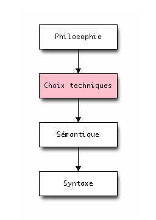

# Un langage est un univers

.fx: image

---

# Comprendre un univers

# Chaque langage est une *vision* du développement

--- 

# Tout est question d&#39;équilibre

.fx: title

---

# import antigravity - xkcd.com/353/

.fx: image

---

# Si je devais résumer

* Python est ennuyeux
* Python n&#39;est pas «hype»
* Python n&#39;a pas de fonctionnalités hallucinantes

# Juste il marche

* Rapidement productif
* Bon voir excellent dans beaucoup de domaines
* Stable & fonctionnel

--- 

# Citations

> “Controlling complexity is the essence of computer programming.”
(Brian Kernigan) 
 
> “Complexity kills.  It sucks the life out of developers, it makes products difficult to plan, build and test, it introduces security challenges, and it causes end-user and administrator frustration.”
(Ray Ozzie) 
 
> “Everything should be made as simple as possible, but not simpler.”
(Albert Einstein)

---

# Domaine d&#39;utilisation

Le site `Python Success` cite ces catégories :

* Web
* Jeu vidéo
* Graphisme / 3D
* Finance
* Science
* Développement logiciel
* Education
* Logiciel business
* Gouvernement

---

# Sociétés utilisatrices connues

* RedHat / Ubuntu / Mozilla
* Disney / Industrial Light & Magic
* Yahoo!
* Blender
* ITA Software
* Bittorrent
* CERN / NASA
* Dropbox
* Eventbrite
* YouTube
* Disqus / SurveyMonkey
* Rackspace Hosting

---

# Google

**Google** est un des plus grands utilisateurs de Python :

> Python where we can, C++ where we must

Le prototype fut développé en Python.

# Beaucoup de développeurs connus chez google :

* Guido Van Rossum
* Alex Martelli
* Greg Stein
* Wesley Chun
* Fredrik Lundh
* Collin Winters

--- 

# Initier au développement

* MIT (6.001, apprendre à programmer un robot)
* Université Paris-Dauphine (Informatique pour la Finance)
* Institut Pasteur (Informatique en Biologie)
* University of Oxford (Département de physique)
* Université de Cambridge
* Université de Stanford
* Dans des collègues / lycées
* Pyladies / Python Montreal

---

# Quelques exemples de projets «cools»

* Zope 2 / Zope 3 (pour leurs histoires)
* Django / Pyramid / Bottle
* numpy / Scipy / scikit / Sage / NTLK
* Twisted
* Plone
* Sphinx
* Fabric / PyExpect
* WxPython / PIL
* SQLAlchemy
* Pygame
* Kivy
* h5py

---

# Langage d&#39;extension

* GIMP
* Blender
* Inkscape
* ...

---

# Projet communautaire

Géré par la Python Software Foundation (PSF)

# Organisation

Dictateur bénévole (BDFL) : Guido Van Rossum

~50 developpeurs

---

# PEP : Python Enhancement Proposal

.fx: image

--- 

# Gestion de projet saine

# Fonctionnalité d&#39;une version N+1 dans la version N

Exemple avec with apparu en 2.6 mais utilisable en 2.5 :

    !python
    from future import with_statement

#  Prévenir dans la N-1 que la fonctionnalité sera retiré dans la version N

Messages `DeprecationWarning` et `PendingDeprecationWarning`.

# Backport de modules 2.7 / 3.2 sur Python 2.5 / 2.6.

Modules packaging, unittest2...

---

# historique  (1)

# Le projet démarre en 1989 :

* 0.9.0 = 1991
* 1.0.0 = 1994
* 1.5.2 = 1998
* 1.6.0 = 2000

---

# historique  (2)

# Première évolution :

* 2.0.0 = 2000
* 2.1.0 = 2001
* 2.2.0 = 2002
* 2.3.0 = 2003
* 2.4.0 = 2004
* 2.5.0 = 2006
* 2.6.0 = 2008
* 2.7.0 = 2010 (dernière branche 2.x officielle)

---

# historique  (3)

# Ré-écriture de Python (branche 3.x) :

* 3.0 = 2008
* 3.1 = 2009
* 3.2 = 2011
* 3.3 = 2012 (aout)

--- 

# Python 2 ou Python 3 ?

# Python 2.7.x est la dernière branche 2.x

L&#39;objectif de la communauté est de switcher à Python 3.x avec la future 3.3.

# La migraion est facilitée avec les backports des nouveautés

* 2.6 <= 3.1 
* 2.7 <= 3.2

Outils :  `2to3` et `six`.

---

# Interpréteurs

L&#39;interpréteur de référence est **CPython**. Mais il exsite :

* IronPython (.NET)
* Jython (Java Virtual Machine)
* PyPy (JIT compiler)
* Stackless Python (microthreads)

**PyPy** est le futur !

---

# PyPy - http://www.pypi.org

# PyPy est un interpréteur Python qui inclus un **JIT**.

PyPy est constitué de deux composants :

* un interpréteur Python, écrit en **RPython**
* une chaîne d&#39;outils qui analyse RPython et le traduit en un langage bas niveau

Actuellement **5.5x** plus rapide que CPython (peut monter à 50x).

---

# Grammaire du C

.fx: image

---

# Grammaire du Javascript

.fx: image

---

# Grammaire de Ruby 1.8.4

.fx: image

---

# Grammaire de Java 1.5

.fx: image

---

# Grammaire de Python 2.3.3

.fx: image

---

# philosophie

# lisibilité

# Homogénéité

# Explicite

# Concision

# simplicité

# extensible

# battery included

# préconiser mais sans imposer (pythonic)

---

# Ma citation préférée sur Python

> Ce qui est simple doit rester simple, ce qui est compliqué doit est possible

---

# Un langage :

* expressif (pseudo code)
* consistent
* orthogonal (manuel de référence : ~100 pages)

--- 

# 31 mots clés

.fx: image

---

# Sémantique (paradigme)

.fx: bigbullet

* structuré
* objet
* fonctionnel

---

# Peu de boilerplate

# Structuré simple :

    !python
    print "hello world!"

# Structuré avec méthode :

    !python
    def hello_world():
        print "hello world!"

# Transformation en code objet :

    !python
    class MyClass(object):
       def hello_world(self):
           print "hello world!"
 
