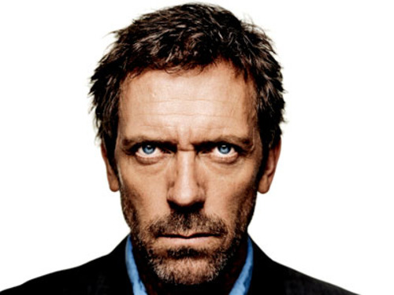

fx: title

# &lt;me&gt;

---

.fx: fullimage

---

.fx: fullimage

---

.fx: fullimage

---

.fx: fullimage

---

.fx: title

# Directeur Technique

---

.fx: title

# Responsable R&D

---

.fx: fullimage

---

.fx: title

# Admin (système, réseau)

---

.fx: title

# Devops

---

.fx: title

# Release Manager

---

.fx: fullimage

---

.fx: title

# Coach

---

# objectif personnel :  rendre une organisation efficace

---

# Lifehacking : (Mindmap, GTD, Pomodoro...)

---

---

.fx: fullimage

---

# @sdouche

---

# sdouche@gmail.com

---

# Mon parcours

Jeune (1985 - 1995) :

* BASIC
* C
* Assembleur x86

---

# Mon parcours

Moins jeune (1996 - 2002) :

* Python / Ruby / Perl / PHP
* REBOL
* ADA
* Eiffel
* Erlang
* Pike
* Tcl/Tk
* Unix Shell
* Smalltalk
* Objective C

---

# Mon parcours

Vieux (2011) :

* Scala
* Javascript
* Coffeescript
* Go
* Lua

---

# &lt;/me&gt;
