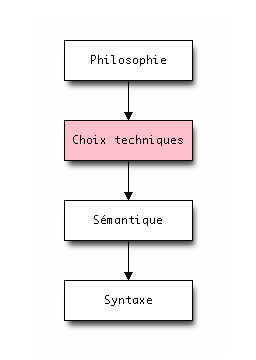
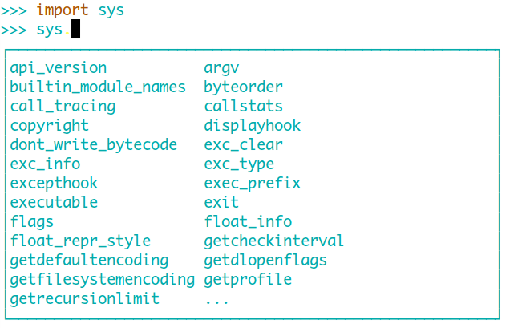

# Un langage est un univers

.fx: image

---

# Comprendre un univers

# Chaque langage est une *vision* du développement

--- 

# Tout est question d&#39;équilibre

.fx: title

---

# import antigravity - xkcd.com/353/

.fx: image

--- 

# Citations

> “Controlling complexity is the essence of computer programming.”
(Brian Kernigan) 
 
> “Complexity kills.  It sucks the life out of developers, it makes products difficult to plan, build and test, it introduces security challenges, and it causes end-user and administrator frustration.”
(Ray Ozzie) 
 
> “Everything should be made as simple as possible, but not simpler.”
(Albert Einstein)

---

# Domaine d&#39;utilisation

Le site `Python Success` cite ces catégories :

* Web
* Jeu vidéo
* Graphisme / 3D
* Finance
* Science
* Développement logiciel
* Education
* Logiciel business
* Gouvernement

---

# Sociétés utilisatrices connues

* RedHat / Ubuntu / Mozilla
* Disney / Industrial Light & Magic
* Yahoo!
* Blender
* ITA Software
* Bittorrent
* CERN / NASA
* Dropbox
* Eventbrite
* YouTube
* Disqus / SurveyMonkey
* Rackspace Hosting

---

# Google

**Google** est un des plus grands utilisateurs de Python :

> Python where we can, C++ where we must

Le prototype fut développé en Python.

# Beaucoup de développeurs connus chez google :

* Guido Van Rossum
* Alex Martelli
* Greg Stein
* Wesley Chun
* Fredrik Lundh
* Collin Winters

--- 

# Initier au développement

* MIT (6.001, apprendre à programmer un robot)
* Université Paris-Dauphine (Informatique pour la Finance)
* Institut Pasteur (Informatique en Biologie)
* University of Oxford (Département de physique)
* Université de Cambridge
* Université de Stanford
* Dans des collègues / lycées
* Pyladies / Python Montreal

---

# Les projets «cools» en Python

* Zope 2 / Zope 3 (pour leurs histoires)
* Django / Pyramid
* numpy / Scypy
* Twisted
* Plone
* Sphinx
* Fabric

---

# Langage d'extension

* GIMP
* Blender
* Inkscape

---

# philosophie

# lisibilité

# Homogénéité

# Explicite

# Concision

# simplicité

# extensible

# battery included

---

# Ma citation préférée sur Python

> Ce qui est simple doit rester simple, ce qui est compliqué doit est possible

---

# Sémantique (paradigme)

.fx: bigbullet

* structuré
* objet
* fonctionnel

---

# Structuré simple

Format script (fichier sample.py) :

    !python
    print "hello world!"

Exécution :

    $ python sample.py
    hello world!

---

# Structuré avec méthode

Transformation en code structuré avec des méthodes : 

    !python
    def hello_world():
        print "hello world!"

    if __name__ == &#39;__main__&#39;:
        hello_world()

Je peux utiliser la méthode en important mon fichier :

    !python
    from sample import hello_world
    hello_world()

---

# objet

Transformation en code objet :

    !python
    class MyClass(object):
       def hello_world(self):
           print "hello world!"
 
    if __name__ == &#39;__main__&#39;:
        test = MyClass() 
        test.hello_world()

---

# Fonctionnel

Python implèmente `lambda`, `map`, `filter`, `reduce` :

    !python
    total = reduce(lambda a, b: (0, a[1] + b[1]), items)[1]

Les itérateurs :

    !python
    L = [1,2,3]
    it = iter(L)
    it.next()

Un code plus `pythonic` :

    !python
    L = [1,2, 3]
    for i in L:
    ...

Générateur d&#39;expression (retourne un itérateur) :

    !python
    stripped_iter = (line.strip() for line in line_list)

List comprehension (retourne un objet liste) :

    !python
    stripped_list = [line.strip() for line in line_list]

Module `functools`, `itertools`, `operator`.

---

# Caractéristiques :

.fx: bigbullet

* Dynamique
* «Fortement» typé
* Duck typing

---

# Dynamique

# variable -> objet -> type

Inutile de typer la variable, mais seulement l&#39;objet :

    !python
    myvar  = 1          # objet int
    myvar = "My string" # objet string
    myvar = ['a']       # objet list

Le type est vérifié à l&#39;éxécution.

---

# «Fortement» typé

Pas de **cast** automatique :

    !python
    >>> a = 1
    >>> b = "my string"
    >>> a + b
    Traceback (most recent call last):
      File "<stdin>", line 1, in <module>
    TypeError: unsupported operand type(s) for +: 'int' and 'str'

.notes: le typage est une échelle, plus ou moins typé

---

# Duck typing

# Vérifie uniquement que la méthode appelée existe et non le type.

.fx: centerquote

> When I see a bird that walks like a duck and swims like a duck
> and quacks like a duck, I call that bird a duck

---

# Un exemple simple

    !python
    class Duck:
        def quack(self):
            print("Quaaaaaack!")
        def feathers(self):
            print("The duck has white and gray feathers.")
 
    class Person:
        def quack(self):
            print("The person imitates a duck.")
        def feathers(self):
            print("The person takes a feather from the ground and shows it.")
        def name(self):
            print("John Smith")
 
    def in_the_forest(duck):
        duck.quack()
        duck.feathers()
 
    def game():
        donald = Duck()
        john = Person()
        in_the_forest(donald)
        in_the_forest(john)
 
    game()

---

# Polymorphisme

# Le Duck Typing permet le polymorphisme.

Comparable au :

* structural type
* interface
* template

---

# **Défauts**

---

# Pas de code métier autour d&#39;un type

# Nécessite de mieux connaitre le fonctionnel

    !python
    class Person:
        def quack(self):
            print("The person imitates a duck.")
        def feathers(self):
            print("The person takes a feather from the ground and shows it.")
        def name(self):
            print("John Smith")

---

# Collage de code non vérifié

    !python
    def my_function(a, b, c, d):
        do_something()

    my_function('a', 2, [], {})

---

# Facilite le code spaghetti

    !python
    struct = {}
    ...
    struct = []
    ...
    struct = ({}, {})

---

# Plus facile de pousser un bug en production

# Aucun avertissement du compilateur

    !python
    def myfunction(value = []):
        do_something()
    ...
    myfunction({'x':1})

---

# Autres

# Pas de refactoring automatique

Même si des IDE comme PyCharm font des progrès.

# Performance

Projet v8 pour JS / LuaJIT / PyPy / Rubinius

---

# **Avantages**

---

# Code structuré en de blocs fonctionnels

# Je n&#39;ai plus besoin de gérer mon arbre de types :

* Limite l&#39;inter-dépendance
* Collage de code simplifié

---

# Simple

# Pousse à la simplicité

    !python
    class Myclass(object):
        def functionA(self):
            do_something()

        def functionB(self):
            do_something()

        def functionC(self):
            do_something()

        def my_function(self):
        ....

---

# Souple

# Il suffit de donner la méthode voulue. La surcharger est triviale :

    !python
    from mock import patch

    @patch('subprocess.Popen')
    def test_process_wrapper_bad_path(self, mock_popen):

        mock_popen.side_effect = OSError(2, 'No such file or directory')

        self.assertRaises(exceptions.AppNotFound,
                          processes.process_wrapper,
                          self.release_dir, 'foo', [], "")

    
---

# API simplifiée

# Pas besoin d&#39;un code pour le type X, le type Y, le type Z.

    !python
    len(struct)

# Un code qui fonctionne avec des structures différentes :

    !python
    class MyClass(object):
        def funcA(self, values):
            for i in values:
                do_something()

    C = MyClass()
    C.funcA('1, 2, 3')
    C.funcA(['1, 2, 3'])
    C.funcA(('1, 2, 3'))

---

# Introspection

    !python
    import imp
    import inspect
    import sys

    if len(sys.argv) >= 2:
    fi    lename = sys.argv[1]
    else:
        filename = 'example.py'

    try:
        (name, suffix, mode, mtype)  = inspect.getmoduleinfo(filename)
    except TypeError:
        print 'Could not determine module type of %s' % filename
    else:
        mtype_name = { imp.PY_SOURCE:'source',
                       imp.PY_COMPILED:'compiled',
                       }.get(mtype, mtype)

        mode_description = { 'rb':'(read-binary)',
                             'U':'(universal newline)',
                             }.get(mode, '')

        print 'NAME   :', name
        print 'SUFFIX :', suffix
        print 'MODE   :', mode, mode_description
        print 'MTYPE  :', mtype_name

---

# Moins de lignes

# Moins de lignes, moins de bugs

Le nombre de bugs par ligne ne dépend pas du langage.

# Moins de lignes, plus de facilité à comprendre

Il est plus facile d&#39;appréhender 10 lignes que 20, 50 que 100, 1000 que 5000.

---

# Pas de phase de compilation

---

# Evaluateur en ligne

.fx: image

---

# Compenser les lacunes

---

# Documentation

Documenter les interfaces (entrée, sortie, exception)

    !python
    def create_conf(work_dir, software, chassis):
        """Create an configuration file

        :param: work_dir: the directory
        :type: work_dir: string
        :param: software: type of software
        :type: software: string
        :param: chassis: type of chassis
        :type: chassis: string
        :returns: nothing
        :raises: nothing
        """

Documenter, mais surtout pourquoi, pas comment !

Sauf comment quand c&#39;est :
* complexe
* non naturel (bug, besoin...)

---

# Doctest

# Ecrire de la documentation valide

    !python
    class Net(object):
    """Simple usage of SubNet constructed above CIDR implementation.

    You can specify your address in both ipv4 or ipv6 CIDR notation:

    >>> Net(&#39;192.168.0.0/24')
    Net(&#39;192.168.0.0/24')

    >>> Net('::ffff:192.168.0.0/120')
    Net(&#39;192.168.0.0/24')

    But also with '*' notation::

    >>> Net('192.168.0.*')
    Net(&#39;192.168.0.0/24')

    >>> Net(24)
    Traceback (most recent call last):
    ...
    TypeError: ..
    """

---

#Refactorer souvent

# Refactoring, refactoring, refactoring...

Idéalement c&#39;est 50% du temps de codage.

---

# Strong typing vs Strong testing

# Beaucoup de tests.

* Les Tests Unitaires couvrent le refactoring
* Les Tests fonctionnels couvrent le fonctionnement général
* Les Tests de bout en bout couvrent les besoins client

Regardez les nouveautés Unittest2 (Python2.7+)

---

# First class function / First class object

Entité qui peut :

* Passée en paramêtre
* Passée en argument
* Retournée comme valeur de retour
* Incorporée dans une structure de donnée

En python, tous les objects sont *first class*.

---

# Exemple 1

On peut écrire :

    !python
    def sumOfSquares(a, b):
        return a**2 + b**2

    def sumOfCubes(a, b):
        return a**3 + b**3

    def sumOfNegatives(a, b):
        return (-a) + (-b)

---

# Exemple 1

Un code *pythonic* :

    !python
    def square(a):
        return a**2

    def cube(a):
        return a**3

    def negative(a):
        return -a

    def sum (a, b, function):
        return function(a) + function(b)

Un code *pythonic* avec le style fonctionnel :

    !python
    sumOfSquares = lambda a, b: sum(a, b, square)
    sumOfCubes = lambda a, b: sum(a, b, cube)

---

# Exemple 2

Je souhaite afficher du texte en spécifiant la couleur :

    !python
    from fabric.colors import *

    def display(msg, color=green):
        print(color(msg))

---

# Exemple 3

Un dispatcher :

    !python
    def handle_one():
        return 'one'

    def handle_two():
        return 'two'

    def handle_default():
        return 'unknown'

    cases = {
        'one': handle_one,
        'two': handle_two,
        'three': lambda: 'three',
    }

    for i in ('one', 'two', 'three', 'four', ):
        handler = cases.get(i, handle_default)
        print handler()

---

# EAFP vs LBYL

Python pousse à la programmation :

*EAFP* (Easier to Ask for Forgiveness than Permission)

et non : 

*LBYL* (Look before you Leap)

    !python
    import sys
    
    try:
        f = open('myfile.txt')
        s = f.readline()
        i = int(s.strip())
    except IOError as (errno, strerror):
        print "I/O error({0}): {1}".format(errno, strerror)
    except ValueError:
        print "Could not convert data to an integer."
    except:
        print "Unexpected error:", sys.exc_info()[0]
        raise

---

# Types de base

# Simples et puissants :

* bool
* int, float, complex
* str, unicode
* tuple
* set, frozenset
* dictionary
* xrange
* file
* exception, module, fonction

---

# Méthodes spéciales

# Basique

* object.\_\_new__(self, other)
* object.\_\_del__(self, other)
* object.\_\_init__(self, other)
* object.\_\_repr__(self, other)
* object.\_\_str__(self, other)
* object.\_\_eq__(self, other)
* object.\_\_cmp__(self, other)
* object.\_\_get__(self, other)
* object.\_\_set__(self, other)
* ...

---

# Méthodes spéciales

# Appelable

* object.\_\_call__(self, other)

# Conteneur

* object.\_\_len__(self)
* object.\_\_getitem__(self)
* object.\_\_setitem__(self)
* object.\_\_delitem__(self)
* object.\_\_iter__(self)

# Context manager

* object.\_\_enter__(self)
* object.\_\_exit__(self)

---

# Exemples

    !python
    def __repr__(self):
        return repr(self.data) 

    def __cmp__(self, dict):                      
        if isinstance(dict, UserDict):            
            return cmp(self.data, dict.data)      
        else:                                     
            return cmp(self.data, dict)           
    
    def __len__(self):
        return len(self.data)

    def __delitem__(self, key):
        del self.data[key]

---

# Types disponibles

# Types dans les modules :

* heapq
* collections (namedtuple, deque, coutner, OrderedDict, defaultdict)
* bisect
* array
* sched
* queue
* ...

---

    !python
    mystruct = [1. 2, 3]
    mystruct = [{1: 'a'}, {2: 'b'}]
    mystruct = [{1: 'a'}, [{2: 'b'}, (1, 2)]]

    new_event = {"description": "test",
                 "name": "Les Concerts & ouvertures praguoises",
                 "sessions": [ { "showDateTimeStart": datetime.datetime.utcnow() } ],
                 "updated": datetime.datetime.utcnow(),
                 "venue": { "name": "Opera",
                            "pCode": "21000",
                            "town": "Dijon",
                            "way": "11 Boulevard de Verdun" }}

---

# Decorateur

Un décorateur permet d&#39;injecter ou de modifier le comportement d&#39;une fonction / classe.

Un décorateur simple :

    !python
    def decorator(func):
        func.is_decorate = True
        return func

    @decorator
    def decorate():
        pass

    decorate.is_decorate

Un décorateur avec un argument :

    !python
    def decorator(attempt):
        def wrapper(func):
            func.attempt = attempt
            return func
        return wrapper

---

# Quelques cas d&#39;utilisation :

* Memoize
* Cache
* Ajout facile de méthodes à une classe
* Compteur
* Deprecation Warnings
* Pre / post condition
* Profiling / debug
* Synchronisation
* Vérification de type
* ACL
* Gestion d&#39;évenement
* Singleton
* ...

---

# Itérateur

# Beaucoup de types de base sont itérables.

On retrouve la philosophie *Faire les choses d&#39;une seule manière* :

    !python
    for element in [1, 2, 3]:
        print element

    for element in (1, 2, 3):
        print element

    for key in {&#39;one':1, 'two':2}:
        print key

    for char in "123":
        print char

    for line in open("myfile.txt"):
        print line

--- 

# Itérateur

Créer un type itérable :

    !python
    class fibnum:
        def __init__(self):
            self.fn2 = 1
            self.fn1 = 1

        def next(self):
            (self.fn1,self.fn2,oldfn2) = (self.fn1+self.fn2,self.fn1,self.fn2)
            return oldfn2

        def __iter__(self):
            return self

    f = fibnum()
    for i in f:
        print i
        if i > 20:
            break

---

# Générateur

Utilisation du mot clé `yield` :

    !python
    def fonction(x):
        while 1:
            yield x
            x = x + 1

     >>> gen = fonction(2)
     >>> gen.next()

---

# List comprehension

Une *list comprenhension* renvoie une liste.

    !python
    S = [2*x for x in range(101) if x**2 > 3]

    T = [x+y for x in &#39;flower' for y in 'pot']

    U = [x+y for x in &#39;flower' for y in 'pot' if x != 'w' and y != 'o' ]

Existe aussi pour les set (set comprehension) et dictionary (dictionary comprehension).

---

# Context manager

Sucre syntaxique qui simplifie le code :

    !python
    with open('foo.txt', 'w') as f:
        f.write('hello!')

Au lieu de :

    !python
    f = open('foo.txt', 'w')
    f.write('hello!')

---

# Lien avec le C

Module ctypes pour utiliser facilement le C :

    !python
    from ctypes import *
    cdll.LoadLibrary("libc.so.6")
    libc = CDLL("libc.so.6")

Projets cython / SWIG.

---

# zope.interface

Création d&#39;une interface :

    !python
    import zope.interface
    class IFoo(zope.interface.Interface):
        """Foo blah blah"""
        
        x = zope.interface.Attribute("""X blah blah""")

        def bar(q, r=None):
           """bar blah blah"""

Utilisation : 

    !python
    class Foo:
        zope.interface.implements(IFoo)

        def __init__(self, x=None):
            self.x = x

        def bar(self, q, r=None):
            return q, r, self.x

        def __repr__(self):
            return "Foo(%s)" % self.x

---

# zope.component

# Compose la `ZCA` (Zope Component Architecture) `zope.interface` et `zope.event`.

Utilise `zope.interface` pour offrir des :

* utilities
* adapter
* subscriptions adapters
* handlers

---

# **Conclusion**

---

# Plaisir de coder

---

# Efficacité

# Permet de coder des scripts de 5 SLOC aux projets de :
* < 50k SLOC «facilement»
* < 150k SLOC avec maitrise
* +150k SLOC avec grande rigueur

---

# Le manque de typage est génant, mais les typages forts actuels sont encore plus génants à mes yeux

---

# Merci :)
